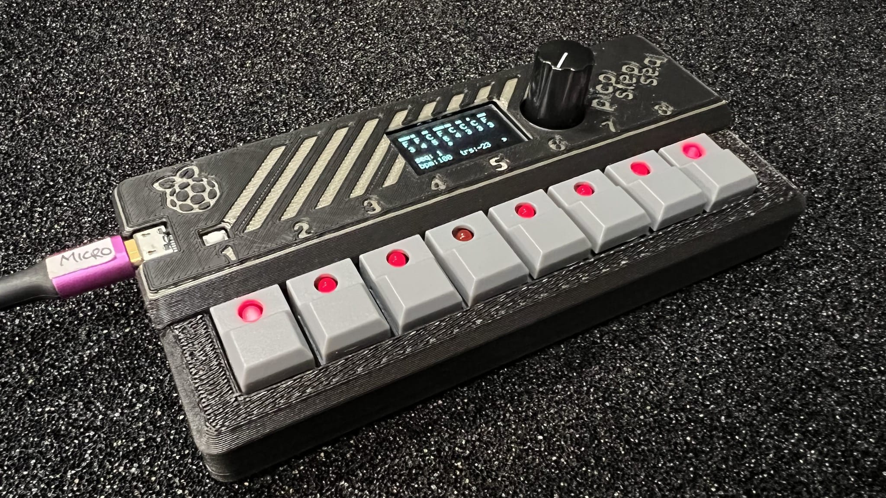
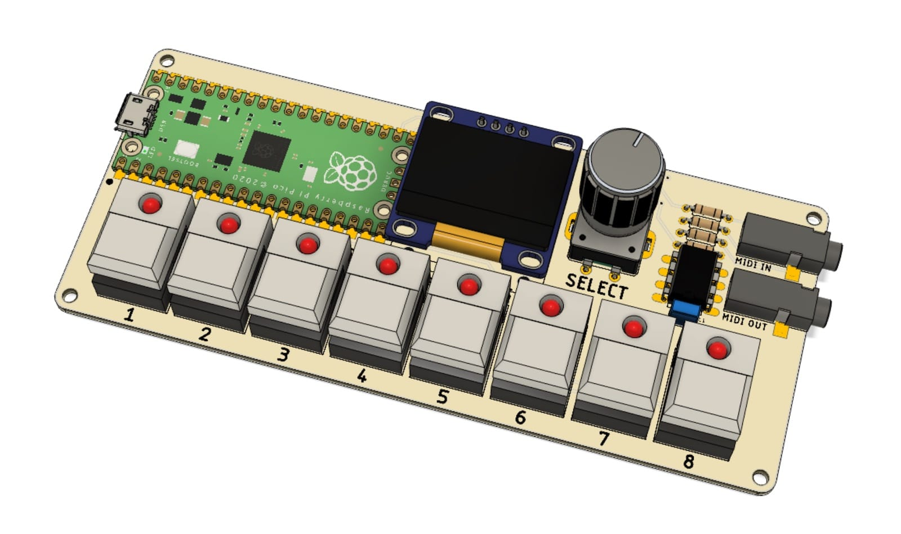
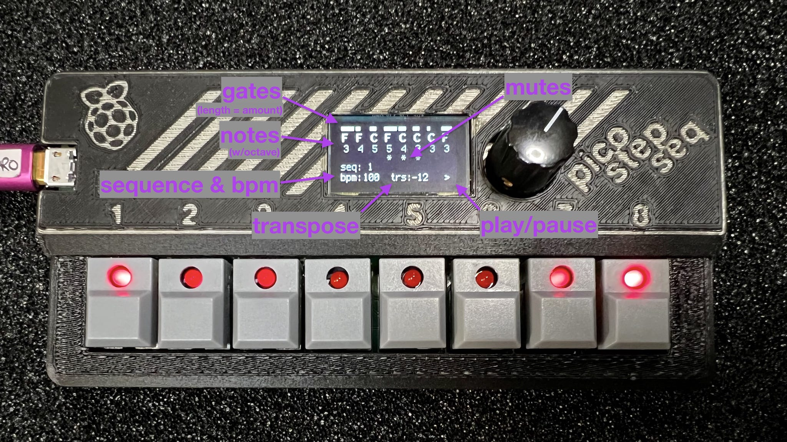
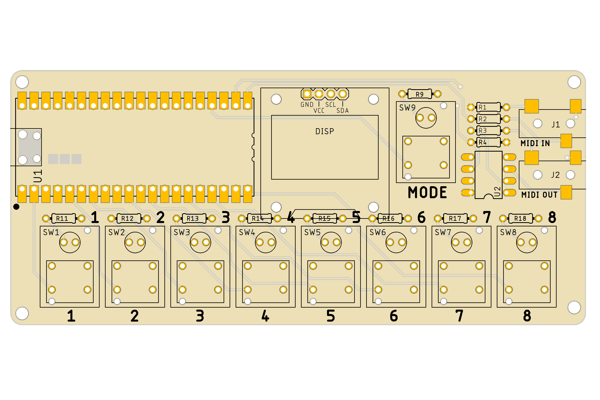
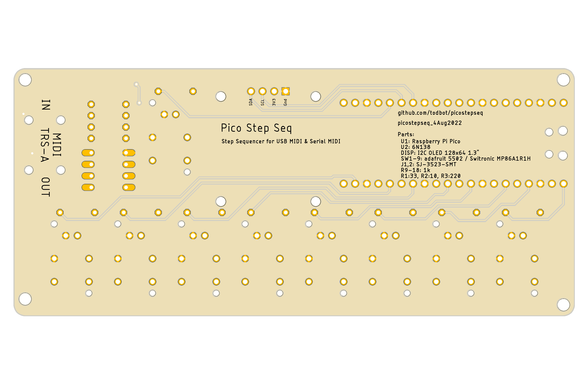

# PicoStepSeq

PicoStepSeq is an 8-step MIDI sequencer using a Raspberry Pi Pico, an I2C SSD1306 OLED display, a rotary encoder. and 8 "Step Switches".  It outputs via USB MIDI and Serial MIDI via TRS-A 3.5mm.

It is designed as a potential DIY kit for people with beginner-level soldering skills
Part count is minimal, with all parts are through-hole, except for the two MIDI jacks,
which are easily solderable by hand.

## Demo video

https://user-images.githubusercontent.com/274093/185005269-afb4c3f7-0ca1-40c8-a17d-6e4756943d87.mov

## How to use

In use, PicoStepSeq has two states: Play and Pause.
It is designed so you never have to stop playing to edit and save/load a sequence.
It has 8 sequence slots that can be edited and are persistently saved to flash.

While Playing, the actions are:

- **Pause** -- Tap encoder button
- **Transpose sequence up/down** -- Turn encoder knob
- **Change tempo BPM** -- Push + turn encoder knob
- **Mute / Unmute steps** -- Tap corresponding step key
- **Change step's pitch** -- Hold step key, turn encoder knob
- **Change step's gate** -- Hold step key, push + turn encoder knob
- **Load sequence** -- Push encoder, tap step key 1-8, release encoder
- **Save sequence** -- Push encoder, hold step key 1-8 for 2 secs, release encoder

When Paused, the actions are:
- **Play** -- Tap encoder button
- **Play notes** -- tap corresponding step key to play its pitch
- **Change step's pitch** -- Hold step key, turn encoder knob

Sequence Save & Load:
- On startup, `saved_sequences.json` is read from disk and loaded into the 8 sequence slots
- Upon transitioning from Play to Pause, all 8 sequences will be written to disk as `saved_sequences.json`

### Step Keys

The 8 "step keys" have an LED that indicate current mute/unmute status and which step is currently being played.
Tap on a step key to mute/unmute it. Hold a key and turn the encoder knob to change the pitch of that step.

### Rotary Encoder

Turning the encoder adjusts the transpose amount of the playing sequence.  Push + turning adjusts the tempo.

### Display

PicoStepSeq can be used without really looking at the display (which is good because the display is very small).
The display is hopefully clear. It's divided into the top section showing 8 notes with gate info and the bottom section showing which sequence, current BPM & transpose, and if the sequencer is in play/pause mode.

### MIDI

PicoStepSeq outputs both USB MIDI and Serial MIDI.

There is preliminary support for syncing to MIDI Clock.

## Building

[Build guide to come!]

### Enclosure

A 3d-printable enclosure is [available on Printables](https://www.printables.com/model/260860-picostepseq-midi-step-sequencer-w-raspberry-pi-pic)

The current enclosure is designed for the case where sockets are used for both the Pico and the OLED display.
This is so either can be removed for other uses, so you don't have to sacrifice a Pico if you want to try this out.

## Installing Firmware (CircuitPython)

The firmware lives in the `circuitpython/picostepseq` directory.

1. Copy all files in the `circuitpython/picostepseq` directory to the CIRCUITPY disk.

2. Install the libraries `adafruit_displayio_ssd1306` and `adafruit_display_text`.

  The command-line tool `circup` is very useful to install libraries:

  `circup install adafruit_displayio_ssd1306 adafruit_display_text`

3. Reset the board and the sequencer should come up!

## Firmware Design (CircuitPython)

[More to come!]

Thanks to [Winterbloom](https://github.com/wntrblm) and [@theacodes](https://github.com/theacodes) for the awesome
[SmolMIDI library](https://github.com/wntrblm/Winterbloom_SmolMIDI) for efficient MIDI parsing.
(and for [really cool Eurorack synthesizer devices](https://winterbloom.com/shop))

**Note:** If you have an [Adafruit MacroPad RP2040](https://www.adafruit.com/product/5128),
you can experiment with the sequencer without building any hardware! The code will auto-detect
if it's running on a MacroPad. Rotate the MacroPad so the display is on the left,
then the sequencer keys are arranged as two rows of four.

## Bill of Materials

Here is a [Digikey cart with most parts](https://www.digikey.com/short/8qh7p87z).

Links also included below for major parts

For basic USB MIDI functionality:

- 1 - "picostepseq" PCB ([OSHpark](https://oshpark.com/shared_projects/vPWjBrmO), I have some to give away, msg me!)
- 1 - Raspberry Pi Pico ([Adafruit](https://www.adafruit.com/product/4864), [Digikey](https://www.digikey.com/en/products/detail/raspberry-pi/SC0915/13624793))
- 1 - 0.96" I2C OLED SSD1306 128x64 display ([Amazon](https://amzn.to/3K1ZAoo))
  - w/ pins in order GND, VCC, SCL, SDA; some have GND & VCC swapped
- 1 - EC11 style rotary encoder w/ switch ([Digikey](https://www.digikey.com/en/products/detail/bourns-inc/PEC11R-4215F-S0024/4499665), [Adafruit](https://www.adafruit.com/product/377)]
- 8 - "step switch" w/ built-in LED ([Adafruit](https://www.adafruit.com/product/5519)]
- 8 - resistor 1k (500 ohm also works) ([Digikey](https://www.digikey.com/en/products/detail/stackpole-electronics-inc/CF18JT1K00/1741612), [Adafruit](https://www.adafruit.com/product/4294)]
- 1 - encoder knob ("Davies 1900" style works well, [Adafruit](https://www.adafruit.com/product/5541))

For both USB + Serial MIDI, add:

- 2 - 3.5mm TRS jack, SJ-3523-SMT-TR
([Digikey](https://www.digikey.com/en/products/detail/cui-devices/SJ-3523-SMT-TR/281297))
- 1 - 6N138 optoisolator ([Digikey](https://www.digikey.com/en/products/detail/liteon/6N138/1969179))
- 1 - 100n capacitor ([Digikey](https://www.digikey.com/en/products/detail/vishay-beyschlag-draloric-bc-components/K104K15X7RF5TL2/286538), [Adafruit](https://www.adafruit.com/product/753))
- 1 - resistor 10 ohm
- 1 - resistor 30 ohm (47 ohm also works)
- 1 - resistor 220 ohm

You can attach the Pico & the OLED display how you like, but if using the 3d-printable "picostepseq_headers" case, you will also need:

- 2 - 20-pin header socket ([Digikey](https://www.digikey.com/en/products/detail/sullins-connector-solutions/PPPC201LFBN-RC/810192), [Adafruit](https://www.adafruit.com/product/5583))
- 2 - 20-pin header pins ([Digikey](https://www.digikey.com/en/products/detail/adam-tech/PH1-20-UA/9830398), [Adafruit ](https://www.adafruit.com/product/392))
- 1 - 4-pin female (same as above, break off 4-pin chunk)

## PCB layout

